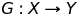
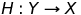
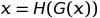
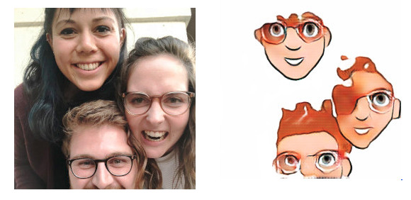
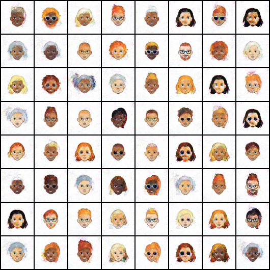
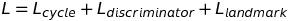
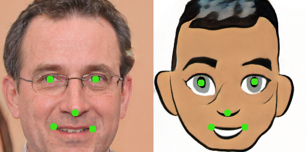
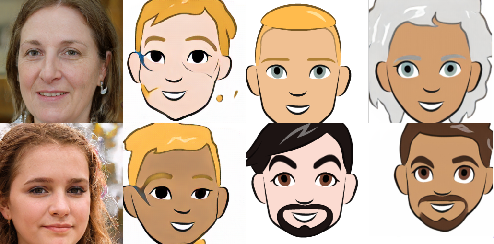

# Conditional cartoon faces incorporating a landmark loss in CycleGAN
We learn how to map a face to a cartoon-face only using unpaired data. For a certain face the mapping to a cartoon style is a complex function . The goal of this project is to learn this function! As starting point we choose CycleGAN.
CycleGAN promises to learn the mapping from
 and its reverse 
using unpaired data. The main idea is to minimize the loss of the transitive "cycle" .
As well as a standard GAN Discriminator losses of each mapping function.

Our contributions:

In order to incorporate additional prior knowledge to the architecture we add another loss term based on landmark predictions. For both: the cartoons and the real images.

To extend the usages of our model we provide a one to ten mapping of real faces to cartoon images: We make the whole architecutre conditional and train the models with ten different hair colors. You are free to choose your color!

## Introduction
Cartoons have their own field in illustration and every artist creates his own style and strokes. Once a style is settled, many artist are able to copy and adapt the patterns and exaggerations. Faces, on the other hand, are hard to draw and also to adapt in style: the right proportions and asymmetries have to match each other perfectly.

The aim of this project is to automatically create faces in the style of the artist Shiraz Fuman. Our creations can then be used as starting point for your own face cartoon or used directly in large scale.

The CycleGAN approach respects the overall structure of the transformed input image: the face will have the same proportions and boundaries like the natural capture. This brings liveliness to drawings.

## Related approaches

### DCGAN
The usual approach is to train directly on the discriminator loss and force the GAN to learn comics without restrictions.
To start we trained a vanilla DCGAN leading to the following result.

The generator has learnt to combine various features of the cartoon dataset into new ones. But the results are not
acceptable: deeper structures like same skin color everywhere have not been learnt.

As the cartoon dataset contains women with beards we can not blame the generator. The input of the generator was
gaussian noise and not real face images.

### Vanilla CycleGAN
Next thing to consider is the vanilla [CycleGAN](https://junyanz.github.io/CycleGAN/). The paper
promises a more restriced environment for better results.
The first results are acceptable. But we discover two problems: the first is a mode collapse: the generator only generates
a few modes of the original cartoon dataset. The second is the liveliness in the generated cartoons: they look exactly like
the cartoon data, but we want something inbetween. Humans turn and move their head and eyes. We would like to 
incorporate this feature to the generated cartoons to have more correspondence between the input face and the generated cartoon.

.. various image of the problems ..

## Contributions

### Landmark loss in CycleGAN
We want to force more correspondence between the cartoon images and real faces. As both domains are faces we enforce
correspondence on their landmarks: a fake should preserve the landmarks of the input image.
To do so we add a new loss term called landmark loss next to the cycle and discriminator loss:
. In other words: during training time the generator gets his gradients from the discriminator, the cycle and the landmark detection. The balance of the lambdas which gives the weights to each loss are very important, as
this landmark loss can now create a state where it is very easy for the discriminator to separate real from fakes.
Experiments have shown that a small landmark lambda of 0.01 helps with the correspondence without destroying the overall learning (the discriminator has a lambda of 1.0).

We do the landmark detection with a convolutional landmark detection network with several layers.
In each training batch, We train the two landmark detectors LD_A on real faces and the LD_B on cartoon faces. As this problem is suspervised we we have labeled our real faces with 5 landmarks. The cartoons have aligned landmarks. To augment the data with a random crop
we had to implement it by ourself in order to preserve the correct coordinates of the landmarks.

#### Results
It is hard to tell what exactly leads to the result we have. But we can show what we generate with and without landmark loss.

We have a test image in the first column and its corresponding fake generated with enabled landmark loss in the
second column. We see that the fake does not look exactly like the original cartoons in the third column. They cover
some kind of facial expression as in the real image (e.g. viewing direction, perspective scaling of the right eye of the girl in the bottom). In the fourth column we have fakes without
landmark loss, they capture more of the original distribution (e.g. the unnatural, direct look to the camera).
We have to admit that we can not prove that this is all due to the landmark loss.

## Git Workflow
Just use classic merge commits if you find out that someone has pushed in meantime.

- git add .
- git commit -m 'message'
- git pull
- [do the merge, git add file, git commit]
- git push

## Project plan
To edit use: https://www.tablesgenerator.com/markdown_tables

| Week 	| Suggestion                	| Planned                                          	| Done 	|
|------	|---------------------------	|--------------------------------------------------	|------	|
| 1    	| create groups             	|                                                  	|      	|
| 2    	| identify challenges       	|                                                  	|      	|
| 3    	| read literature           	|                                                  	|      	|
| 4    	| propose solution          	|                                                  	|      	|
| 5    	| propose solution          	| literature, search for data, project description 	| yes  	|
| 6    	| propose solution (due A1) 	| download data, preprocessing ides (not much)      | yes   |
| 7    	| data preparation          	| everybody runs cycleGAN                         	| some  |
| 8    	| coding                    	| train on cropped faces, start implementation    	| yes  	|
| 9    	| coding (due A2)           	|                                                  	|      	|
| 10   	| easter holiday            	| break                                           	| yes  	|
| 11   	| net training              	| landmark loss, own datasets, more training      	| yes 	|
| 12   	| net training              	| landmark loss and conditional implementation    	| yes  	|
| 13   	| experiments               	| merge code base, implement showcase             	|      	|
| 14   	| Report & Presentation     	|                                                  	|      	|
| 15   	| Review                    	|                                                  	|      	|

## Issues

We define the faces as domain A, the cartoons as domain B. We store the images in folders under:
./datasets/customName/{trainA, trainB, testA, testB}. The results under ./results/customName/.

To work on a task, put your name in the column and shout to slack!

| Task                    	| Description                                                                                                                    	| Assigned 	| Status 	|
|-------------------------	|--------------------------------------------------------------------------------------------------------------------------------	|----------	|--------	|
| Parse command line args 	| Provide a way to store and retrieve configurations.                                                                            	|          	|        	|
| DataLoader              	| Load and preprocess (crop) images out of the folders trainA, trainB, testA, testB                                              	| Jan      	|        	|
| CycleGAN Training       	| - Create some first architectures for the Generator{A2B, B2A} and Discriminator{A, B} Networks. - Implement training procedure 	| Gautam   	| Working on |
| CycleGAN Test           	| - Implement test procedure "run GeneratorA2B"                                                                                  	|          	|        	|
| Training Visualization  	| - Dump learning rates (per Network) - Dump network weights - visualize reconstruction "A to B to A"                            	|          	|        	|
| Test Visualization      	| have fun ...                                                                                                                   	|          	|        	|

## Markdown O.o
Help is here: https://guides.github.com/features/mastering-markdown/

